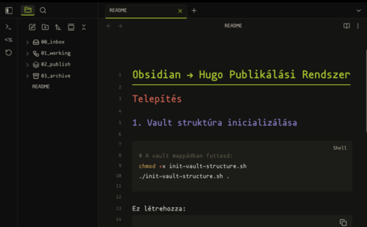

# Werkstatt - Obsidian Theme

> *Köztes tér. Mozgásban. A Werkstatt: mindig most.*

A warm, minimal theme for [Obsidian](https://obsidian.md) inspired by the workshop aesthetic — where ideas take shape.

## Features

- 🌗 **Dark & Light modes** — Both carefully crafted
- 🎨 **Warm color palette** — Natural, earthy tones
- 📝 **Section-colored headings** — H1-H6 each with distinct colors
- ✨ **Minimal distractions** — Clean, focused writing environment
- 🔗 **Styled blockquotes & code** — Left-border accent style
- ✅ **Custom checkboxes** — Olive green completion
- 🏷️ **Beautiful tags** — Subtle olive highlighting

## Color Palette

| Color | Hex | Usage |
|-------|-----|-------|
| Olive | `#848B23` / `#a8c830` | Primary accent, links, tags |
| Rust | `#A8361B` / `#c75d4d` | H2, warnings |
| Purple | `#31185A` / `#8b7ec8` | H3, examples |
| Beige | `#D7D4CD` | Background (light), H6 |
| Cyan | `#6ab0a3` | H4, external links |
| Yellow | `#d4a656` | H5, highlights |

## Heading Colors

- **H1** — Olive (with bottom border)
- **H2** — Rust
- **H3** — Purple
- **H4** — Cyan
- **H5** — Yellow
- **H6** — Beige

## Installation

### Community Themes (Recommended)
1. Open Obsidian Settings
2. Go to **Appearance** → **Themes**
3. Click **Manage** → Browse community themes
4. Search for "**Werkstatt**"
5. Click **Install and use**

### Manual Installation
1. Download `theme.css` and `manifest.json`
2. Create folder: `[YourVault]/.obsidian/themes/Werkstatt/`
3. Place both files in the folder
4. Restart Obsidian
5. Settings → Appearance → Theme → Select "Werkstatt"

## Screenshots

### Dark Mode

### Light Mode

## Customization

The theme respects Obsidian's native font settings:
- Settings → Appearance → Font

Recommended fonts:
- **Monospace:** IBM Plex Mono, JetBrains Mono, Mononoki
- **Text:** IBM Plex Sans, Inter

## About Werkstatt

*Werkstatt* — German for "workshop". A space where the craftsman works, where tools are at hand, where half-finished pieces await continuation.

Not a gallery. Not a museum. **A workshop.**

## Credits

Created by [brtkcs](https://brtkcs.com)

Part of the [Werkstatt Design System](https://brtkcs.com/werkstatt/)

## License

MIT License — Use freely, modify as you wish.

---

*A Werkstatt: mindig most.*
